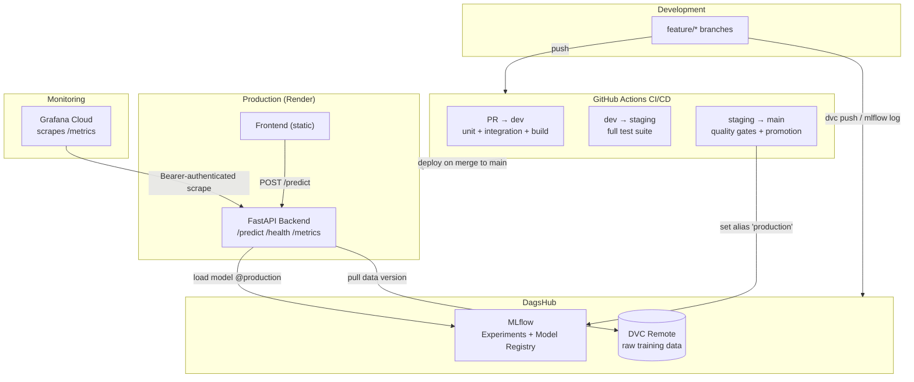

# Credit Default Prediction — MLOps Final Project

An end-to-end, production-grade machine learning system that serves a credit-default
prediction model through a web app, with a full MLOps lifecycle: data versioning,
experiment tracking, a model registry, CI/CD with guard gates, automated model
promotion, containerized deployment, and live production monitoring.

> The focus of this project is **execution quality** across the MLOps lifecycle, not
> model accuracy or the business idea itself.

---

## Table of Contents

1. [Business Case & Dataset](#business-case--dataset)
2. [Architecture](#architecture)
3. [Tech Stack](#tech-stack)
4. [Repository Structure](#repository-structure)
5. [Git Branching Model](#git-branching-model)
6. [CI/CD Pipelines](#cicd-pipelines)
7. [Data & Model Versioning](#data--model-versioning)
8. [Model Promotion Pipeline](#model-promotion-pipeline)
9. [Monitoring](#monitoring)
10. [Reproducibility Instructions](#reproducibility-instructions)
11. [Team](#team)

---

## Business Case & Dataset

The app predicts whether a credit-card client will **default on their next payment**
(binary classification). It is built on the UCI *Default of Credit Card Clients*
dataset (~30,000 rows, 23 features), which is clean, tabular, and permissively
licensed (CC BY 4.0) — a deliberate choice so the effort goes into the MLOps
tooling rather than data cleaning or model tuning.

- **Input:** 23 client features (credit limit, demographics, 6 months of payment
  history, bill amounts, and payment amounts).
- **Output:** `prediction` (0 = no default, 1 = default) and `probability`.
- **Model:** a scikit-learn `RandomForestClassifier`.

---

## Architecture



**Flow in one sentence:** developers work on `feature/*` branches; data and models
are versioned to DagsHub (DVC + MLflow); CI/CD validates every change and, on the
path to `main`, runs quality gates that promote a model to the `production` alias;
Render serves the backend which loads that promoted model; and Grafana Cloud scrapes
the live `/metrics` endpoint for monitoring.

---

## Tech Stack

| Concern | Tool |
|---|---|
| ML / model | scikit-learn |
| Backend API | FastAPI + Uvicorn |
| Frontend | Static HTML/JS served by nginx |
| Data versioning | DVC (remote on DagsHub) |
| Experiment tracking & registry | MLflow (hosted on DagsHub) |
| Containerization | Docker + Docker Compose |
| CI/CD | GitHub Actions |
| Cloud hosting | Render |
| Monitoring | Prometheus client + Grafana Cloud |

---

## Repository Structure

```
.
├── .github/workflows/
│   ├── pr-to-dev.yml           # PR → dev pipeline
│   ├── dev-to-staging.yml      # dev → staging pipeline
│   └── staging-to-main.yml     # staging → main promotion pipeline
├── data/raw/
│   └── credit_default.csv.dvc  # DVC pointer (real data lives on the remote)
├── ml/
│   ├── prepare_data.py         # one-off cleaning of the raw dataset
│   ├── train.py                # training + MLflow logging + registry
│   ├── evaluate.py             # quality gates
│   ├── promote.py              # assigns the 'production' alias
│   └── params.yaml             # hyperparameters (versioned)
├── backend/
│   ├── app/
│   │   ├── main.py             # FastAPI app (/predict, /health, /metrics)
│   │   ├── model.py            # loads model from the MLflow registry
│   │   ├── schemas.py          # request/response validation
│   │   └── monitoring.py       # Prometheus metrics
│   ├── tests/                  # 3 unit + 2 integration + 1 e2e
│   ├── requirements.txt
│   └── Dockerfile
├── frontend/
│   ├── index.html
│   └── Dockerfile
├── monitoring/
│   └── prometheus.yml
├── docker-compose.yml
├── requirements.txt
└── README.md
```

---

## Git Branching Model

Development follows a strict four-tier flow. Code only ever moves left to right, and
`dev`, `staging`, and `main` are protected (no direct pushes; changes land via Pull
Requests that must pass CI).

```
feature/*  →  dev  →  staging  →  main
(develop)     (integrate)  (pre-prod)  (production)
```

Each tier maps to a CI/CD pipeline (see below).

---

## CI/CD Pipelines

Environment-specific configuration is injected at runtime from **GitHub Secrets**
(12-factor), never hard-coded.

### 1. `PR → dev` — `pr-to-dev.yml`
Runs on every pull request targeting `dev`.
- Runs **unit tests** and **integration tests**.
- **Builds** the backend and frontend Docker images (build only, **no push**).
- The Docker build step only runs if tests pass.

### 2. `dev → staging` — `dev-to-staging.yml`
Runs when changes reach `staging`.
- Runs the **full test suite**, including the **end-to-end test** (which loads the
  real model from the registry using the MLflow credentials from GitHub Secrets).
- Validates the code that will move toward production.

### 3. `staging → main` — `staging-to-main.yml`
Runs on the path to production and implements the **model promotion** with guard
gates (detailed below). Merging into `main` triggers the production deployment on
Render.

### Testing Requirements (met)
- **3 unit tests** — schema validation, output typing, feature-reordering logic.
- **2 integration tests** — `/health` and `/predict` routes (model mocked, so CI
  needs no external credentials for these).
- **1 end-to-end test** — real request against the app with the real model loaded
  from the registry. It skips cleanly when MLflow credentials are absent (e.g. an
  external PR) and runs for real in the credentialed pipelines.

---

## Data & Model Versioning

**Data (DVC).** The raw training dataset is tracked with DVC and stored on a DagsHub
remote. Git only stores the small `.dvc` pointer, so every training run can be traced
to an exact data version.

**Models (MLflow + DagsHub).** Training runs are logged to MLflow. Each model version
records:
- metrics (accuracy, F1, precision, recall),
- parameters (from `ml/params.yaml`),
- the **DVC data version** (hash of the `.dvc` file), and
- the **Git commit hash**.

The ordered list of feature names is logged as an artifact (`feature_names.json`)
alongside each model and used at serving time to reorder incoming requests — this
prevents training/serving skew.

**The registry is the single source of truth for deployments.** The backend loads the
model referenced by the `production` alias and never serves anything else in prod.

---

## Model Promotion Pipeline

The promotion pipeline is the core of the project. On the path to `main`, a candidate
model must pass automated **quality gates** before it can be promoted.

```
Train candidate → Register in MLflow → Run quality gates → (pass?) → alias 'production'
                                                          → (fail?) → stays candidate,
                                                                       production unchanged
```

**Quality gates** (`ml/evaluate.py`) — the candidate must satisfy all of:
- **Accuracy** ≥ threshold,
- **F1 score** ≥ threshold,
- **Prediction latency** ≤ limit (ms).

If any gate fails, `evaluate.py` exits with a non-zero status, which **stops the
pipeline** — the promotion step never runs, and production is left untouched. If all
gates pass, `ml/promote.py` assigns the `production` alias to the validated version,
and the next Render deployment serves it.

> **Note on the registry API:** the model is loaded by **version number**
> (`models:/credit-default-model/<version>`), resolving that version from the
> `production` alias. This is intentional — it is the most portable way to load from
> the DagsHub-hosted registry across MLflow client versions.

---

## Monitoring

The production backend exposes a Prometheus-compatible `/metrics` endpoint. It is
**Bearer-token protected** (via the `METRICS_TOKEN` environment variable) so it is not
publicly readable.

**Exposed metrics:**
- `prediction_requests_total` — total number of prediction requests,
- `prediction_latency_seconds` — prediction latency histogram,
- `prediction_failures_total` — number of failed requests,
- `backend_up` / `backend_uptime_seconds` — health and uptime.

**Collection & visualization.** Grafana Cloud's *Metrics Endpoint* integration scrapes
the **live production** `/metrics` URL every 60 seconds (authenticated with the bearer
token) and stores the series. A Grafana dashboard visualizes:
- request volume over time,
- prediction latency over time,
- failed requests / error rate,
- backend health status.

A local alternative is also included: `docker-compose.yml` runs Prometheus and Grafana
next to the backend for development.

## Reproducibility Instructions

### Prerequisites
- Python 3.11
- Docker & Docker Compose
- Access to the project's DagsHub token (for DVC + MLflow)

### 1. Clone and set up the environment
```bash
git clone <your-github-repo-url>
cd <repo>
python -m venv .venv
source .venv/bin/activate        # Windows: .venv\Scripts\activate
pip install -r requirements.txt
```

### 2. Configure secrets
Copy the template and fill in the values:
```bash
cp .env.example .env
```
`.env` must contain:
```
MLFLOW_TRACKING_URI=https://dagshub.com/<user>/<repo>.mlflow
MLFLOW_TRACKING_USERNAME=<dagshub-user>
MLFLOW_TRACKING_PASSWORD=<dagshub-token>
MODEL_ALIAS=production
METRICS_TOKEN=<your-metrics-token>
```

### 3. Pull the versioned data
```bash
dvc remote modify origin --local access_key_id <dagshub-token>
dvc remote modify origin --local secret_access_key <dagshub-token>
dvc pull
```

### 4. Train a model (optional — a promoted model already exists)
```bash
python ml/train.py
```

### 5. Run everything locally with Docker
```bash
docker compose up --build
```
- Backend API + docs: `http://localhost:8000/docs`
- Frontend: `http://localhost:8080`
- Prometheus: `http://localhost:9090`
- Grafana: `http://localhost:3000` (default login `admin` / `admin`)

### 6. Run the tests
```bash
cd backend
pytest -v
```

## Team

- `Mathis Beurotte`
- `Thomas Murphy`
- `Justine Roecker`
